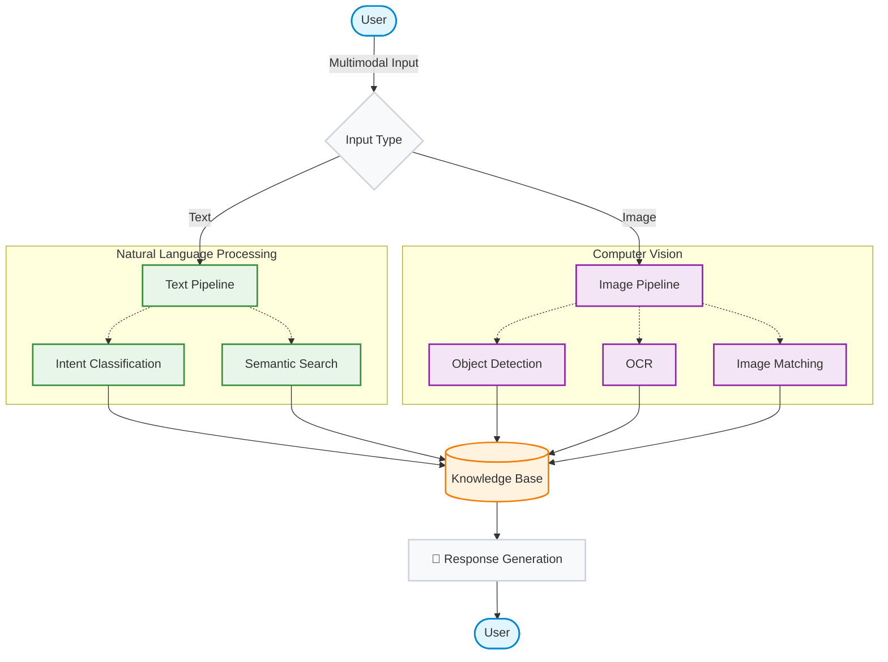

# Hospital AI Chatbot

> An AI-powered hospital chatbot that assists users in searching for department information, contact numbers, locations, and IT support services. The system supports multimodal interaction by combining text and image inputs to provide intelligent and efficient assistance.


---

# Overview

This project was developed to improve access to hospital information and simplify IT support requests through an AI-powered chatbot.

The chatbot combines Natural Language Processing (NLP), Semantic Search, Computer Vision, and OCR technologies to understand user queries and provide relevant responses. It also includes a web-based administration dashboard for managing hospital information and the knowledge base.

---

# Features

## Semantic Department Search

- Semantic search powered by SentenceTransformer
- Supports natural language queries
- Handles department aliases and synonyms
- Retrieves department information quickly and accurately

---

## Intent Classification

Automatically classifies user requests using Machine Learning.

Supported intents include:

- Department phone numbers
- Department locations
- IT support requests
- General department information

Powered by:

- scikit-learn
- Logistic Regression
- TF-IDF Vectorizer

---

## Computer Vision & OCR

### IT Equipment Detection

Detects IT equipment from uploaded images using **YOLOv8**.

Supported objects include:

- Computer Monitor
- Keyboard
- Mouse
- Laptop
- Other supported devices

---

### OCR Text Recognition

Extracts text from uploaded images using **Tesseract OCR**.

Features

- Thai & English OCR
- Image preprocessing
- Error message recognition
- Warning label extraction
- System code recognition

---

### Image Similarity Matching

Uses **ImageHash** to compare uploaded images with previously recorded IT troubleshooting cases.

This helps identify recurring IT issues and improves troubleshooting efficiency.

---

# Performance Optimization

Designed for efficient processing and scalability.

- In-memory Knowledge Base caching
- MySQL Connection Pooling
- Thread-safe logging
- Optimized semantic search
- Optimized image processing pipeline

---

# Admin Dashboard

A built-in web administration panel allows administrators to manage chatbot information without modifying the source code.

Functions include

- Department Management
- Department Aliases
- Phone Numbers
- Locations
- IT Troubleshooting Knowledge Base
- Knowledge Base Updates

Default URL

```
http://localhost:5000/admin
```

---

# Technology Stack

## Backend

- Python
- Flask
- Flask-CORS
- Waitress

## Artificial Intelligence

### Natural Language Processing

- SentenceTransformer
- scikit-learn (Logistic Regression)

### Computer Vision

- Ultralytics YOLOv8
- Tesseract OCR
- ImageHash

## Database

- MySQL
- mysql-connector-python

## Frontend

- HTML5
- CSS3
- JavaScript

---

## 🧠 AI Pipeline



---

# Project Structure

```text
hospital-ai-chatbot/
│
├── static/
│   ├── css/
│   ├── js/
│   └── uploads/
│
├── templates/
│
├── data/
│
├── app.py
├── ai_excel_chat.py
├── semantic_search.py
├── intent_classifier.py
├── train_intent.py
├── object_detector.py
├── ocr_module.py
├── image_matcher.py
├── db_config.py
├── logger.py
├── import_excel.py
│
├── requirements.txt
├── .env.example
└── README.md
```

---

# Installation

## 1. Clone Repository

```bash
git clone https://github.com/your-username/hospital-ai-chatbot.git

cd hospital-ai-chatbot
```

---

## 2. Install Dependencies

```bash
pip install -r requirements.txt
```

> **Note:** Install **Tesseract OCR** separately before running the application.

---

## 3. Configure Database

Create a MySQL database.

```sql
CREATE DATABASE hospital;
```

Import the provided SQL schema into the database.

---

## 4. Configure Environment Variables

Create a `.env` file.

```env
DB_HOST=localhost
DB_USER=root
DB_PASS=your_password
DB_NAME=hospital
DB_PORT=3306

SECRET_KEY=your_secret_key

TESSERACT_CMD=C:\Program Files\Tesseract-OCR\tesseract.exe
```

---

## 5. Run the Application

```bash
python app.py
```

Open your browser

```
http://localhost:5000
```

---

# Admin Panel

```
http://localhost:5000/admin
```

The administration dashboard allows users to

- Manage departments
- Edit aliases
- Update phone numbers
- Update locations
- Manage IT troubleshooting knowledge
- Maintain the Knowledge Base

---

# Key Highlights

- Semantic Search using SentenceTransformer
- Machine Learning Intent Classification
- YOLOv8 Object Detection
- OCR with Image Preprocessing
- Image Similarity Matching
- Knowledge Base Caching
- MySQL Connection Pooling
- Web-based Admin Dashboard
- Multimodal Interaction (Text + Image)

---

# My Contributions

- Developed an AI-powered hospital chatbot using Flask.
- Implemented semantic search with SentenceTransformer for department retrieval.
- Built a Machine Learning intent classification model using Logistic Regression and TF-IDF.
- Integrated YOLOv8, Tesseract OCR, and ImageHash for image-based IT support.
- Designed and implemented the MySQL database and data import utilities.
- Developed a web-based administration dashboard for knowledge base management.
- Improved system performance through caching, connection pooling, and optimized processing.

---

# Future Improvements

- Conversation memory for multi-turn interactions
- Support for Large Language Models (LLMs)
- Voice-based interaction
- Multi-language support
- Mobile application integration

---

# License

This project is intended for educational and research purposes.
